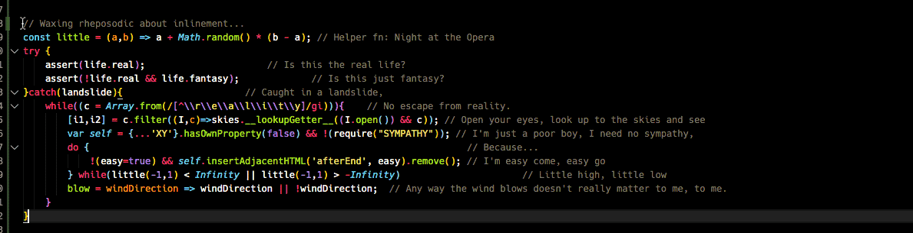

# Inlinement README

VSC Extension to align inline comments by their leading "//"

## Features

 - **Efficient**

    _Nearly-instantaneous execution, even across large numbers of lines with widely varying contents_

 - **Extremely-lightweight**

    _< 2k, uncompressed_

 - **Passive**

    _Invokes on-demand, no always-on, resource-hungry background processes_

 - **Versitle**

    _Supports virtually all languages that themselves support inline comments_

 - **Actively-Supported**

    _I'm a 25-year veteran developer so OCD-anal-retentive that I:_

    A. _Wrote the stupid thing in the first place, and..._

    B. _Continue to use it myself. 6-7 days a week, 8-14 hours a day. Longer on weekends._

    _Damn right I'll fix it if its broke._

## Usage
   

### Requirements

None.

### Dependencies

None.

### Restrictions

None.

### Cost

Your solemn promise that, starting the same day you install it, that you will **COMMENT. YOUR. DAMN. CODE!**

## Extension Settings

Not screwing with em for the initial release. Lemme get conversant with the ecosystem, first.

Intended:

- [TOGGLE] Auto-trim trailing whitespace

- [TOGGLE] Auto-trim leading whitespace (e.g. reduce excess space between EOL and start of `//`)

- [INPUT] Custom delimiter support (beyond // and #)

- [IFF TOGGLE] Auto-scoping

   - Align (upwards/downwards/both from caret position) to farthest-right, within selection (default)
   - Align (upwards/downwards/both from caret position) to farthest-right, until a line has no comment
   - Align (upwards/downwards/both from caret position) to farthest-right, in same scope as caret
   - Align (upwards/downwards/both from caret position) to farthest-right, on active page

- [TOGGLE, INPUT] Align to pre-defined Column position

-        // [EVENT]
         // Wrap excessively-long inline comments either automatically onto the line(s) that follow...
         //  ... the active cursor position's line, or evenly-distributing the comment in the first...
         //  ... across all the remaining lines in the selection, & pre/appending (optional) ellipses.

- [IFF TOGGLE, INPUT] Screen boundary support:

   - [OPTION] Right-aligned to configured character width of Screen

   - [OPTION] Wrapped so as to preclude horizontal scrolling (using the distribution logic, above)

   - [OPTION, INPUT] Byte-Burnin' Boxes

            // ---- Add a Title and/or Top Border ----
            // | & ensure all lines to follow remain |
            // | within the designated width (or, at |
            // | least until you close 'em). Because |
            // | 64k should be enough for anyone, K? |
            // ---------------------------------------

## License

[Offensive Limerick](http://bit.ly/limerick_license)

## Resource code

https://github.com/NerdyDeedsLLC/vscode-inlinement

## Release Notes

### 0.0.1

Initial release.